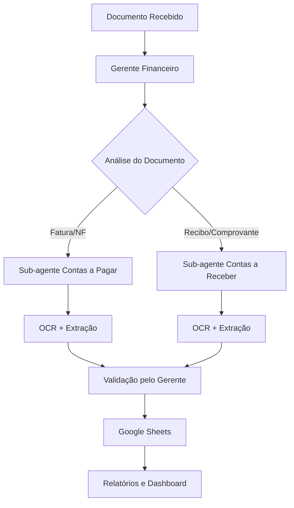

# Sistema Financeiro Inteligente MottivMe

## Visão Geral

O **MottivMe Financeiro** é um sistema inteligente de gestão financeira baseado em arquitetura hierárquica de agentes especializados. O sistema automatiza o processamento de documentos financeiros, extração de dados via OCR e organização em planilhas Google Sheets.

## Arquitetura do Sistema

### Estrutura Hierárquica

```
┌─────────────────────────────────────┐
│         GERENTE FINANCEIRO          │
│      (Coordenador Central)          │
└─────────────┬───────────────────────┘
              │
    ┌─────────┴─────────┐
    │                   │
┌───▼────────────┐ ┌────▼──────────────┐
│ SUB-AGENTE     │ │ SUB-AGENTE        │
│ CONTAS A PAGAR │ │ CONTAS A RECEBER  │
└────────────────┘ └───────────────────┘
```

### Agentes Especializados

1. **Gerente Financeiro** - Coordenador central que:
   - Analisa e categoriza documentos recebidos
   - Distribui tarefas para sub-agentes apropriados
   - Valida dados extraídos
   - Gera relatórios consolidados
   - Monitora fluxo de caixa

2. **Sub-agente Contas a Pagar** - Especialista em:
   - Processamento de faturas e notas fiscais
   - Extração de dados de fornecedores
   - Controle de vencimentos
   - Organização na planilha de pagamentos

3. **Sub-agente Contas a Receber** - Especialista em:
   - Processamento de recibos e comprovantes
   - Extração de dados de clientes
   - Controle de recebimentos
   - Análise de inadimplência

## Funcionalidades Principais

### 🔍 Processamento Inteligente de Documentos
- **OCR Avançado**: Extração automática de dados de imagens
- **Validação Inteligente**: Verificação de consistência dos dados
- **Categorização Automática**: Identificação do tipo de documento

### 📊 Integração Google Sheets
- **Organização Automática**: Dados inseridos em planilhas estruturadas
- **Fórmulas Avançadas**: Cálculos automáticos de totais e métricas
- **Dashboard Consolidado**: Visão unificada das finanças

### 🔄 Fluxo de Trabalho Hierárquico
- **Coordenação Centralizada**: Controle pelo Gerente Financeiro
- **Especialização**: Cada agente focado em sua área
- **Eficiência**: Processamento paralelo e otimizado

## Estrutura do Projeto

```
mottivme-financeiro/
├── README.md                    # Este arquivo
├── prompts/                     # Prompts dos agentes
│   ├── gerente-financeiro.md    # Prompt do coordenador
│   ├── contas-a-pagar.md       # Prompt do sub-agente pagamentos
│   └── contas-a-receber.md     # Prompt do sub-agente recebimentos
└── ferramentas/                # Ferramentas N8N
    ├── ocr-processamento.md    # Ferramentas de OCR
    └── google-sheets-integration.md # Integração Google Sheets
```

## Como Usar

### 1. Configuração Inicial

1. **Clone o repositório**:
   ```bash
   git clone https://github.com/marcosdanielsf/mottivme-financeiro.git
   cd mottivme-financeiro
   ```

2. **Configure as credenciais**:
   - Google Sheets API
   - Serviços de OCR
   - Webhooks N8N

### 2. Implementação no N8N

1. **Importe os prompts** dos agentes no N8N
2. **Configure as ferramentas** de OCR e Google Sheets
3. **Estabeleça os workflows** de comunicação entre agentes
4. **Teste o fluxo completo** com documentos de exemplo

### 3. Fluxo de Trabalho



### 4. Exemplo de Uso

1. **Envie uma imagem** de fatura para o sistema
2. **Gerente Financeiro** analisa e identifica como "contas a pagar"
3. **Sub-agente Contas a Pagar** processa com OCR
4. **Dados extraídos** são validados pelo Gerente
5. **Informações organizadas** na planilha Google Sheets
6. **Alertas automáticos** para vencimentos próximos

## Ferramentas N8N Incluídas

### Processamento OCR
- **OCR Avançado Financeiro**: Extração de dados gerais
- **OCR Especializado Recebimentos**: Focado em comprovantes
- **Validador de Qualidade**: Verificação de imagens

### Integração Google Sheets
- **Integrador Contas a Pagar**: Organização de pagamentos
- **Integrador Contas a Receber**: Organização de recebimentos
- **Atualizador de Totais**: Cálculos automáticos
- **Gerador de Dashboard**: Relatórios consolidados

## Tecnologias Utilizadas

- **N8N**: Automação de workflows
- **OCR Services**: Extração de texto de imagens
- **Google Sheets API**: Organização de dados
- **Vibe-Prompter**: Estruturação de prompts
- **Webhooks**: Comunicação entre sistemas

## Benefícios

✅ **Automatização Completa**: Reduz trabalho manual em 90%
✅ **Precisão Elevada**: OCR especializado em documentos financeiros
✅ **Organização Inteligente**: Dados estruturados automaticamente
✅ **Controle Centralizado**: Supervisão pelo Gerente Financeiro
✅ **Escalabilidade**: Arquitetura preparada para crescimento
✅ **Relatórios Automáticos**: Insights financeiros em tempo real

## Configuração de Permissões

### Google Sheets
- **Gerente Financeiro**: Acesso completo
- **Sub-agentes**: Escrita em colunas específicas
- **Usuários**: Apenas leitura do dashboard

### N8N Workflows
- **Administrador**: Configuração completa
- **Operador**: Execução de workflows
- **Visualizador**: Apenas monitoramento

## Suporte e Contribuição

Para dúvidas, sugestões ou contribuições:

1. **Issues**: Reporte problemas ou solicite funcionalidades
2. **Pull Requests**: Contribua com melhorias
3. **Documentação**: Ajude a melhorar a documentação

## Licença

Este projeto está sob licença MIT. Veja o arquivo `LICENSE` para mais detalhes.

---

**MottivMe Financeiro** - Transformando a gestão financeira através da inteligência artificial e automação inteligente.
